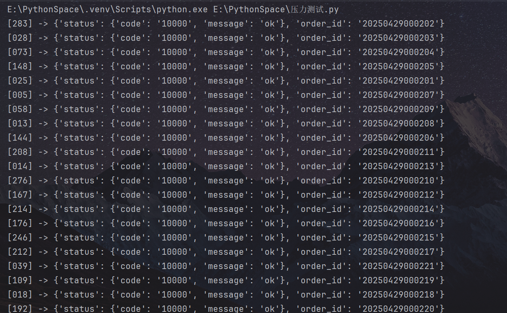
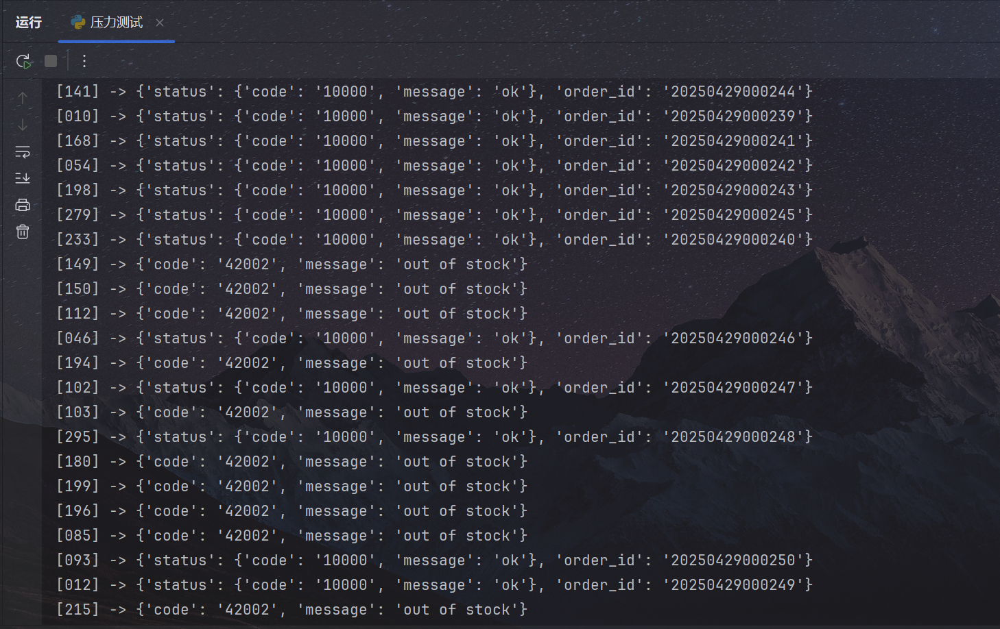
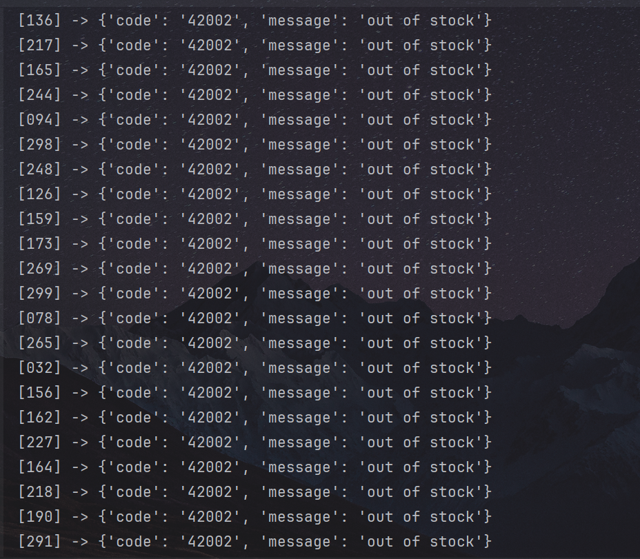
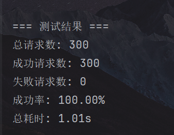
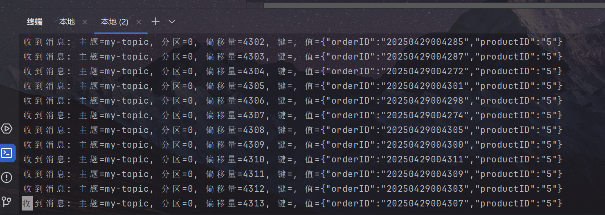
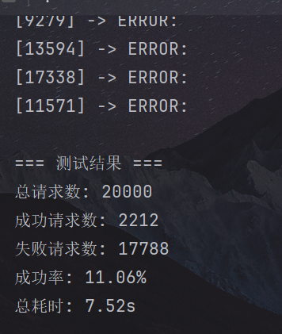

# 1.技术栈及其作用

本系统使用了如下技术栈，来应对一个抢购系统可能会出现的各种问题，以及实现其功能：

1. `go`：作为整个系统的编程语言。
2. `hertz`：作为网关，来连接前端和`rpc`。
3. `kitex`：作为`rpc`框架，处理并发操作，应对突发大流量访问，以及增强系统防挂能力。
4. ~~`nginx`：负责负载均衡，将访问流量均匀分配到`kitex`客户端的多个进程。~~（未实现）
5. `mysql`：作为数据库，存储商品、用户等的信息。
6. `redis`：用于缓存商品状态、原子扣减库存、用户抢购标记、接口层加速和预处理。在内存中处理预购买，用户只需要几毫秒就能收到返回的消息。
7. `kafka`：作为消息队列框架，起到削峰的作用。将消息放入队列，后端再一条一条处理。
8. `gorm`：使用它来更方便操作数据库。

# 2.抢购流程

## 2.1.抢购开始前

将库存提前预热到`redis`中缓存，若此时有抢购请求，返回未开始。

## 2.2.抢购开始后

请求回路：客户->`Hertz&Kitex`客户端网关->`Kitex`服务端->进入`dao`层，进行`redis`缓存击中->在`redis`中使用原子操作扣减库存->向客户返回下单成功，订单正在处理，以及订单号/下单失败，库存不足->成功的订单进入`kafka`队列->被`kafka`消费者监听到->执行业务逻辑，在`mysql`中进行库存扣减操作，并将订单号和下单状态插入数据库，供用户查询。

在拿到订单号后，可以使用查询订单接口，使用订单号查询订单下单状态，除非内部错误或者因`redis`原子锁失效而引起的超售，一般都是成功。

由于为小demo，~~懒得~~无余力设计用户级别分层系统，故设定为已登录用户为商城管理员，未登录的游客即可购买商品。

## 2.3.抢购结束后

~~撤掉`redis`中的缓存，若仍然有请求，返回无库存。~~（没实现，都是些擦屁股的事情，时间仓促所以还是算了）

# 3.接口文档

https://ess5f7hjbp.apifox.cn

# 4.压力测试

按照如下格式，设置抢购活动，同时使用python代码测试并发性能：

```json
{
    "item_id": 1,
    "amount": 50,
    "start_time": "2025-04-29 18:30:00",
    "end_time": "2025-04-29 21:00:00"
}
```

代码：

```python
import asyncio
import aiohttp
import random
import time
import json

# 配置项
URL = "http://127.0.0.1:8888/seckill/buy"
ITEM_ID = 1
TOTAL_REQUESTS = 300
# 模拟“前有后有”的分布，随机延迟0~1秒开始请求
MAX_START_DELAY = 1.0
TIMEOUT = 5  # 单个请求超时（秒）

async def buy(session, idx, results):
    # 随机延迟，让用户“前有后有”到达
    await asyncio.sleep(random.uniform(0, MAX_START_DELAY))
    payload = {"item_id": ITEM_ID}
    try:
        async with session.post(URL, json=payload, timeout=TIMEOUT) as resp:
            text = await resp.text()
            # 尝试解析 JSON
            try:
                data = json.loads(text)
            except json.JSONDecodeError:
                data = {"raw": text}
            # 实时打印返回结果
            print(f"[{idx:03d}] -> {data}")
            # 判断是否成功
            code = data.get("status", {}).get("code")
            success = 1 if code == "10000" or "42002" else 0
    except Exception as e:
        print(f"[{idx:03d}] -> ERROR: {e}")
        success = 0
    results.append(success)

async def main():
    t0 = time.time()
    results = []
    # 限制最多 TOTAL_REQUESTS 个并发任务
    sem = asyncio.Semaphore(TOTAL_REQUESTS)
    async with aiohttp.ClientSession() as session:
        tasks = []
        for i in range(1, TOTAL_REQUESTS + 1):
            # 每个任务都在 semaphore 控制下执行
            async def sem_task(idx):
                async with sem:
                    await buy(session, idx, results)
            tasks.append(asyncio.create_task(sem_task(i)))
        # 等待所有请求完成
        await asyncio.gather(*tasks)
    t1 = time.time()

    # 汇总成功率
    success_count = sum(results)
    print("\n=== 测试结果 ===")
    print(f"总请求数: {TOTAL_REQUESTS}")
    print(f"成功请求数: {success_count}")
    print(f"失败请求数: {TOTAL_REQUESTS - success_count}")
    print(f"成功率: {success_count / TOTAL_REQUESTS * 100:.2f}%")
    print(f"总耗时: {t1 - t0:.2f}s")

if __name__ == "__main__":
    # 运行前请确保已安装 aiohttp：pip install aiohttp
    asyncio.run(main())
```

以下是测试结果：

可以看到，在库存充足的前半段，清一色的抢购成功：


在库存即将耗尽的中段，开始体现**“先来不一定先抢到”**（从订单号的非升序排列也可以看出），抢到的和没抢到的混在一起:



在后半段，则是清一色的没抢到，证明确实是来晚了：



最后看数据统计，返回结果只有抢到和未抢到，**综合请求成功率为100%**，说明这套系统足够稳定：



当然上面的库存只有50，~~也就是被50系显卡耍猴时的情况~~，接下来看看更适合现实的情况：把库存放大到10000，把抢购人数放大到20000。

```json
{
    "item_id": 5,
    "amount": 10000,
    "start_time": "2025-04-29 18:30:00",
    "end_time": "2025-04-29 21:00:00"
}
```

go这边收消息都收出了残影：



估计是我电脑内存吃满了的缘故（一共才16G），成功率出奇的低，应该是配置问题：


真正检验高并发的情况时，就得换台好点的机器了。并发3000成功率100%是我手上这台机器的极限了，升级内存后应该好点。

# 5.后续可以改进的点

1. 高并发时，如果硬件不够，`redis`和`mysql`里面的库存会对不上，导致货没卖完（目前还没出现超售的情况，不过也不太可能，因为`redis`库存都没扣的话，怎么可能进行后面`mysql`的步骤呢）。如何建立高并发下的补偿机制值得考虑。
2. 游客直接购买有些危险了，可以考虑加入oauth，再将用户等级分层。

# 6.结语

本次项目略显仓促，所以在编写接口时没有像之前curd正式大项目时加一些合法校验啥的，**只保证正确的输入能够正常工作**。

但是这次项目也让我学到了很多，比之前整天curd学到的多的多的多，解决了一大堆问题（从1.2.0的日志可以看出）。

即使已经很难了，我感觉我对这些技术栈还是停留在运用甚至套用的程度，尚未真正理解。加油吧！

